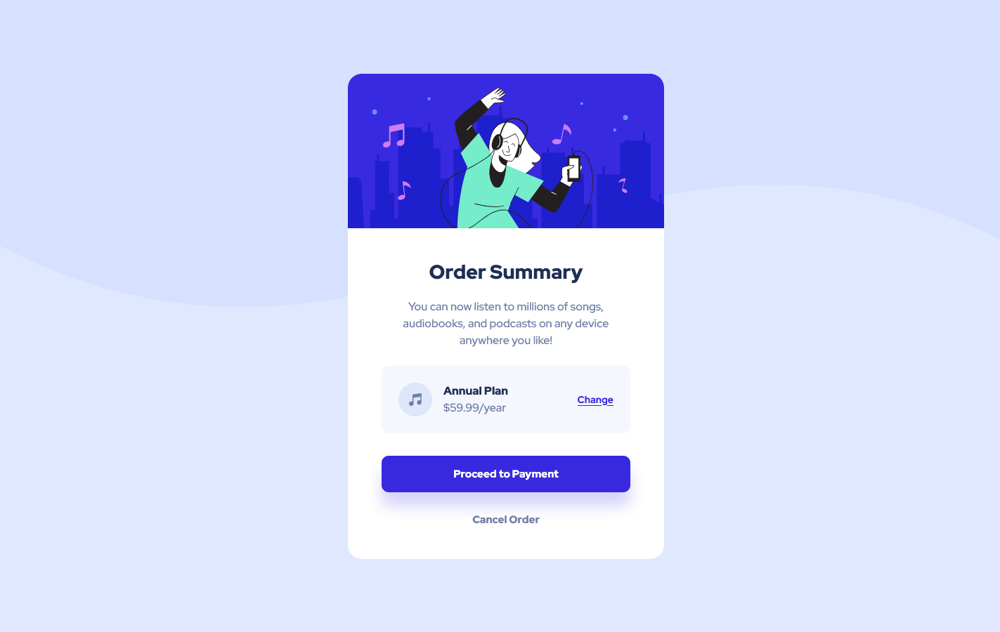

# Frontend Mentor - Order summary card solution

This is a solution to the [Order summary card challenge on Frontend Mentor](https://www.frontendmentor.io/challenges/order-summary-component-QlPmajDUj). Frontend Mentor challenges help you improve your coding skills by building realistic projects.

## Table of contents

- [Overview](#overview)
  - [The challenge](#the-challenge)
  - [Screenshot](#screenshot)
  - [Links](#links)
- [My process](#my-process)
  - [Built with](#built-with)
  - [What I learned](#what-i-learned)
- [Author](#author)

## Overview

### The challenge

Users should be able to:

- See hover states for interactive elements

### Screenshot

### Links

- Solution URL: [Github](https://www.github.com/YayoKB/fem-order-summary-component)
- Live Site URL: [Github Pages](https://www.yayokb.github.io/fem-order-summary-component)

## My process

### Built with

- Semantic HTML5 markup
- CSS custom properties
- Flexbox
- CSS Grid
- Mobile-first workflow

### What I learned

I tried to use more variables, such as for colours and font weights. I did learn recently that setting `line-height: 0` could fix some padding issues.

## Author

- GitHub - [YayoKB](https://www.github.com/YayoKB)
- Frontend Mentor - [@YayoKB](https://www.frontendmentor.io/profile/YayoKB)
